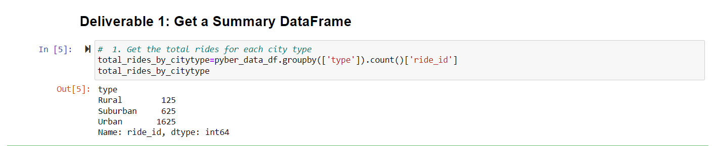
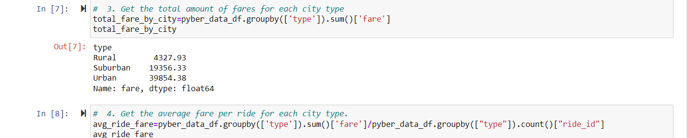
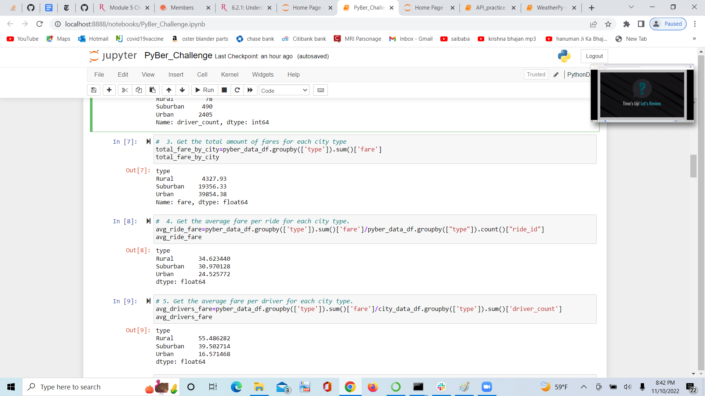
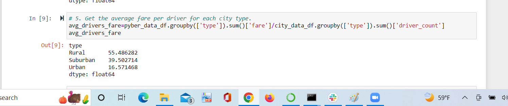

# PyBer_Analysis

  ## PyBer_Challange

## **Overview of the analysis:**

  ### **Purpose**
        Through this challange we learn mearging DataFrame with the use of code.we retrived desirable data output which we want for the line chart.
          So, the main purpose of this module is just raise the bar of coding incompare to last module challange and checking the ability of student about the coding           through th whole challange.
          
  ## **Results:**
  
  ### **Use scipy.stats:**
        In the previous challange we use pandas,matplotlib,and Numpy in this challange we also use scipy.stats along with all pandas library. 
        
  ###### **Different new Functions we used through this module:**
  
  1. **index.name:**
         With the use of this function we give the name of index line in table and also **Delete** the index name Example:df.index.name = None.
  2. **pd.to_datetime():**
         With the use of this function we can make the column readable as datetime or set the datatype of that column as date which is readable as string column         3. **Reset_index():**
         With the use of this function we can Reset the index.
  4. **Pivote_table():**                                                                                                                                                        For creating pivote table we can use the pivote_table()example:Array=df.pivot_table(index="",columns="",values="").
  5.  **info():**                                                                                                                                                                With the use of this function we can get the information about the table like column information,count datatypes etc.
  6.  **Resample:**                                                                                                                                                              This function is use for get the data as per time series.In this challange we retriving data by weekly with the use of this function.
  
   ###### **Description of DataFrame and Line Chart with summary:**
   
  1. **DataFrame Description:**
        First we can get the total ride by city type.
        We used **groupby** for getting total fare of each city which is basically devided into the 3 types **Urabn,Suburban,Rural** and use **sum()** for getting             total no of fare.
        
        
        Second we can get the total drivers by city type.
        we can used same method which we can use for retriving total ride we can perform the sum() on **driver_count** colunm instead of **ride_id** here.
        
        
        Here we retriving the total fare of each city type.
        using same quary as we used in the first both calculations.we just swipe the sum() on **fare**
        
        
        Now we calculate the average **ride_fare** and average **driver_fare** for the average we just divided the **total_fare** from **total_ride** and 
        **total_driver** simultaniously.
        
        
        
        After getting all the data we create the **DataFrame** which contains all the data we retrive above.
        
        
        As we can see in the DataFrame the avg_driver_fare is very higher in the **Rural city** and lower in **Urban city** so if they increased the ride in Urban area 
        then avg_driver_fare must be increased in this area.
        
   2. **Line Chart:**
        We creating the Line chart from the total fare of city type in the year 2019.
        1. As we can see in this line chart that **Rural city type** fare is always below the **$500**.
        2. The **Suburban city type** fare is always between the range of **$500 and $1500**.And,
        3. The **Urban city type** fare is always between the range of **$1500 to 2500**.
        4. In all the city type we can see that the fare is always flactuated through out start to end.
        5. The fare is fluctuated in all the city type but there is no **Drastic Change** we noticed through January to April.
              
        
        

        
        
  
 
   
   
   
        
   
        
  
